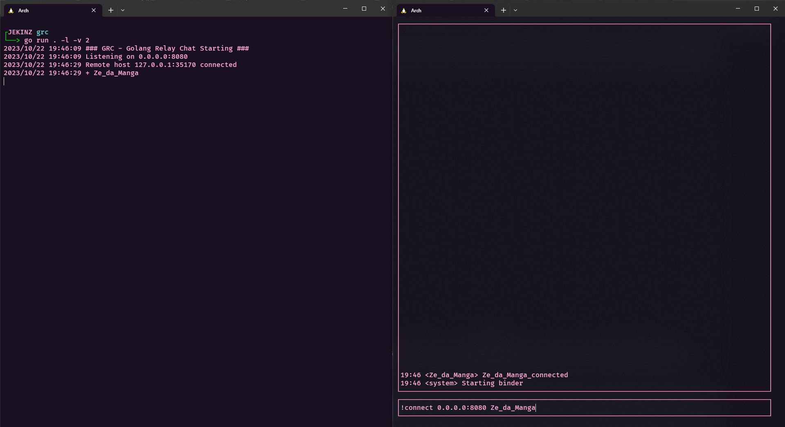

# Simple Golang Relay Chat

### Start the Server

Pass the parameter `-l` to start listening.

- `-a` to configure the local listener address (`-a 127.0.0.1:4444`).
- `-v` to configure the logging verbosity (`-v 2`)

```
╰─$ go run . -l -v 2
2023/12/13 09:05:03 ### GRC - Golang Relay Chat Starting ###
2023/12/13 09:05:03 Listening on 0.0.0.0:8080
```

### Use The Interface
Run the main package and you will be oppened the TUI interface.

Type in the input `!connect <server> <username>` so you be connected to the server.

```
!connect 0.0.0.0:8080 myname
```

As feedback you will receive the following message on the prompt:

```
09:10 <myname> myname_connected
09:10 <system> Starting binder 
```

The server may output the following lines:

```
2023/12/13 09:10:16 Remote host 127.0.0.1:34628 connected
2023/12/13 09:10:16 + myname
```

To start a conversation with `othername` you can set it as a target so that your messages are directed to them.

```
!target othername
```

You may see the following line being prompted:

```
09:17 <myname> Talking to othername
```

The other user must set you as target to have the messages directed tou you.

To exit the interface, press `ESC`.

Message structure.

```
<username>\xff<mensagem>\x00
```

